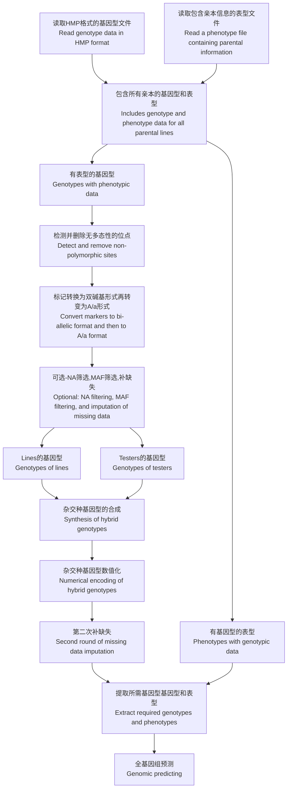
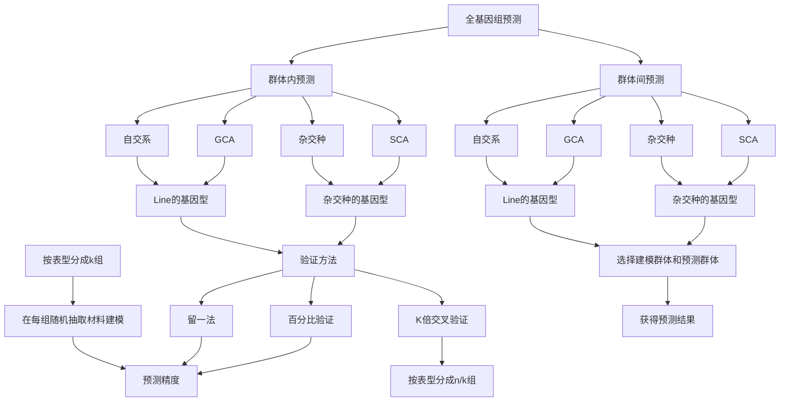

# hybrid_combingAbility_predicting

[TOC]

**制作：张敖 [https://datahold.cn](https://datahold.cn/)**

# 鸣谢/Acknowledgments

张学才，CIMMYT，指导

## 最新更新/Latest updates

【2020-08-20 11:27:57】

完成群体间的预测。

Complete predictions between populations.

【2020-08-14 16:29:29】

完成k-倍交叉验证的部分，同时，支持对表型分组抽取，避免抽样太偏。

Complete the k-fold cross-validation section, and include support for grouping and sampling phenotypes to avoid biased sampling.

【2020-08-13 21:26:49】

修改了A/a数值化的转换逻辑。

The conversion logic for A/a digitization has been modified.

【2020-08-12 01:07:10】

rrBULP的留一法和百分比验证完成。

The leave-one-out and percentage verification of rrBULP is completed.

【2020-08-07 16:29:25】

重新构思验证流程，准备预测模块化，为BGLR预留位置。

Redesign the validation workflow and prepare it for predictive modularization, reserving a place for BGLR.

【2020-08-06 01:01:31】

增加了输出筛选后的HMP文件（可选），可以用TASSEL打开。

增加了全基因组分析前的第二轮补缺失功能，支持最大似然、有限最大似然和概率方法。

Added an option to output filtered HMP files (optional), which can be opened in TASSEL.

Introduced a second round of missing data imputation before genome-wide analysis, supporting maximum likelihood, restricted maximum likelihood, and probabilistic methods.

【2020-08-05 00:21:41】

重写了杂交种合成部分，调换了文件筛选逻辑。

修正了双碱基基因型NA为空的BUG。

Rewrote the hybrid synthesis module and adjusted the file filtering logic.

Fixed a bug where double-base genotypes with NA were treated as empty values.

【2020-07-17 14:36:44】

完成留一法和百分比法的预测框架。

Completed the prediction framework for leave-one-out and percentage-based methods.

【2020-07-08 16:59:48】

完成主要功能，基于rrBLUP对材料的预测。

Completed the main functionality, enabling prediction of materials based on rrBLUP.

## 整体流程/Overall workflow






## 功能/Functionality

1. 基因型与表型自动对应（需一致的材料名称）。
2. 自动删除无多态性位点"polymorphism <- TRUE"。
3. 自动按照最小等位基因频率筛选标记。
4. 自动按照缺失值筛选标记。
5. 三种方法补缺失。
6. 输出补缺失前后的缺失频率直方图。【GenoInfo/freqNA.pdf】【GenoInfo/freqNA.pdf】
7. 可以输出原本标记数量和最终使用的标记数量。
8. 可以输出筛选后的HMP文件。
9. 杂交种基因型的合成和输出【GenoInfo/hybrid_numeric_Geno.txt】。
10. 可进行群体间的预测（实际应用）和群体内的验证"predict_inpop <- TRUE"。
11. 可以对自交系、杂交种、GCA和SCA预测。
12. 可以输出每个材料的预测值，用于比较前10%或任意比例的材料重合性。可依据此指导实际生产。

1. Automatic matching of genotypes and phenotypes (requires consistent sample/line names).
2. Automatic removal of non-polymorphic markers ("polymorphism <- TRUE").
3. Automatic filtering of markers based on minor allele frequency (MAF).
4. Automatic filtering of markers based on missing rate.
5. Three methods for missing data imputation.
6. Output histograms of missing data frequency before and after imputation [GenoInfo/freqNA.pdf][GenoInfo/freqNA.pdf].
7. Output the original number of markers and the final number of markers used.
8. Output the filtered HMP file.
9. Synthesis and output of hybrid genotypes [GenoInfo/hybrid_numeric_Geno.txt].
10. Supports prediction between populations (practical application) and within-population validation ("predict_inpop <- TRUE").
11. Enables prediction for inbred lines, hybrids, GCA, and SCA.
12. Outputs predicted values for each sample, allowing comparison of top 10% (or any proportion) of selected materials to guide practical breeding decisions.

## 基因型数据示例/Example of genotype data

基因型数据需要包含杂交种双亲的数据，材料名必须和表型数据中的材料名一致。缺失值N。

Genotype data must include the parental lines of the hybrids, and the sample names must match those in the phenotype data. Missing values should be coded as “N”.

| rs#     | alleles | chrom | pos     | strand | assembly# | center | protLSID | assayLSID | panelLSID | QCcode | Line1 | Line2 | Tester1 | Tester2 |
| ------- | ------- | ----- | ------- | ------ | --------- | ------ | -------- | --------- | --------- | ------ | ----- | ----- | ------- | ------- |
| marker1 | G/A     | 1     | 48976   | +      | NA        | NA     | NA       | NA        | NA        | NA     | G     | G     | G       | G       |
| marker2 | A/C     | 1     | 419416  | +      | NA        | NA     | NA       | NA        | NA        | NA     | A     | A     | A       | A       |
| marker3 | C/T     | 1     | 560744  | +      | NA        | NA     | NA       | NA        | NA        | NA     | C     | C     | C       | C       |
| marker4 | G/T     | 1     | 560836  | +      | NA        | NA     | NA       | NA        | NA        | NA     | G     | G     | G       | G       |
| marker5 | C/T     | 1     | 688505  | +      | NA        | NA     | NA       | NA        | NA        | NA     | C     | C     | N       | T       |
| marker6 | A/G     | 1     | 1067033 | +      | NA        | NA     | NA       | NA        | NA        | NA     | G     | A     | G       | G       |

## 表型数据示例/Example of phenotype data

表型数据包含LINE列和TESTER列，如果没有TESTER列可以为空。第三列为性状列，没有固定名称要求。当只有群体个体基因型而没有TESTER时，则TESTER列留空，只保留列名。若LINE或TESTER是杂交种，则以@隔开，如：Line1@Line2。多个性状可以在后面添加列。

Phenotype data should include a LINE column and a TESTER column; if there is no TESTER, it can be left empty. The third column is the trait column, with no fixed naming requirement. When only population individual genotypes are available and there is no TESTER, keep the TESTER column empty but retain the column name. If LINE or TESTER represents a hybrid, use “@” to separate the parents, e.g., Line1@Line2. Multiple traits can be included by adding additional columns afterward.


| LINE  | TESTER  | GY_A_CML576 |
| ----- | ------- | ----------- |
| Line1 | Tester1 | 6.326213    |
| Line2 | Tester1 | 6.710173    |
| Line3 | Tester1 | 6.430777    |
| Line4 | Tester1 | 6.060662    |
| Line5 | Tester2 | 5.813892    |
| Line6 | Tester2 | 6.355156    |
| Line7 | Tester2 | 5.708606    |
| Line8 | Tester2 | 6.172415    |

## 讨论/Discussion

1. 是否应该中心化和标准化基因型矩阵？

   - 中心化和标准化的作用是使数据的结果在0~1之间，通过Line和Tester相应位置的数值相乘合成杂交种基因型数据，而rrBLUP要求数据在-1到1之间，相乘将获得错误的基因组遗传信息，考虑不使用中心化和标准化过程。
   - 经过合成，如果LINE的基因型是-1，而TESTER的基因型是1，则杂交种的基因型是-1，这显然是不对的。
   - HMP格式的文件，杂合等位基因采用IUPAC（International Union of Pure and Applied Chemistry，国际纯粹与应用化学联合会）命名法，双等位基因由单个字母表示。考虑应该先将HMP的杂合子（"R","Y","S","W","K","M"）转换为相应的双碱基形式，再合成四碱基形式。
     - ？最大等位基因和最小等位基因如何确定？
       - 等位基因频率计算需要0,1,2编码。然后根据公式rowMeans(GD2,na.rm=T)/2 计算。

2. 四个碱基的组合有多少种？

   - 双碱基组合有10种（不考虑顺序）：

     >  AA、TT、CC、GG、AT、AC、AG、TC、TG、CG

   - 四碱基组合有100种，去掉重复部分有35种：

     

     > 要对35种组合进行编码，且保存必要的遗传信息确实很困难。因此，再次对基因型数据进行研究。
     >
     > 从每个位点看，应该不会这么复杂。假设每个位点只有2个等位基因。该假设符合实际，某一位点突变两次或以上并保留下来的情况比较罕见。

   - 对某一个位点，假设（G/A）,只有5种：

     |      | GG   | AA       | AG       |
     | ---- | ---- | -------- | -------- |
     | GG   | GGGG | ~~AAGG~~ | ~~AGGG~~ |
     | AA   | AAGG | AAAA     | ~~AAAG~~ |
     | AG   | AGGG | AAAG     | ~~AAGG~~ |

     > 推荐编码：
     >
     > 1. 需要先合成杂交种的四碱基基因型；
     > 2. 只保留纯和字母型，得到最大等位基因；
     > 3. 根据最大等位基因，确定数值并将四碱基基因型转换为数值型；
     >    - 如果没有纯合情况如何处理？因此，应该先转换为A/a形式，再计算。

     |              |      | "-101" | "012" |
     | ------------ | ---- | ------ | ----- |
     | 最大等位基因 | AAAA | 1      | 2     |
     | 最小等位基因 | GGGG | -1     | 0     |
     | 无偏杂合     | AAGG | 0      | 1     |
     | 偏大杂合     | AAAG | 0.5    | 1.5   |
     | 偏小杂合     | AGGG | -0.5   | 0.5   |

     > 编码方式：
     >
     > 1. 将材料转换为数值型，用"012"编码，即，最大等位基因2，最小等位基因0，杂合1。
     > 2. 组合杂交种时，用对应位点用加法运算。
     > 3. 通过矩阵整体减1，变成"-101"的形式。

     |         |        | 1      | 0      | 0.5    |
     | ------- | ------ | ------ | ------ | ------ |
     |         |        | **AA** | **GG** | **AG** |
     | **1**   | **AA** | 2      | 1      | 1.5    |
     | **0**   | **GG** | 1      | 0      | 0.5    |
     | **0.5** | **AG** | 1.5    | 0.5    | 1      |
     
   - 最终敲定的合成形式：

     > 考虑到拓展性，即对三交种和双交种的支持。先将单碱基表示形式转变为双碱基表示形式，然后合成杂交种的四碱基形式。三交种为六碱基形式，双交种为八碱基形式。最后，利用每个材料在每个位点上A的比例赋值。
     >
     > 例如：
     >
     > 1. HMP格式中，Line1的某个位点上的碱基是A，Tester1的是W，则先将A变为AA，W变为AT，杂交种为AAAT。
     > 2. 利用该位点所有材料获得最大等位基因和最小等位基因（碱基），假设最大等位基因（碱基）是A，最小等位基因（碱基）是T。变为A/a形式，AAAa。
     > 3. 根据最大等位基因的比率赋值，全为A：AAAA=1，全为a：aaaa=0，则AAAa=0.75。三交种和双交种同理。

3. 合成杂交种时，缺失值的处理？

   - AA×NA→NA。

     > 按照缺失处理，三交种或双交种会有更多的NA出现，最后通过最大似然等方法补缺失以减少对结果的影响。

   - AA×NA→AA。

     > 合成忽略缺失，不影响三交种和双交种的合成。一个位点造成的影响较小。

   - 严格筛选，无NA。

     >  标记数量较少。对全基因组预测结果影响较大，适合使用芯片等缺失值少的方法。

   - 不严格筛选，用概率方案补缺失。

     > 概率方案补缺失可能正确也可能错误。由于基于概率，补充正确的可能性应该高于错误的情况。

4. 自交系预测、杂交种预测、GCA预测和SCA预测的基因型是什么？

   - 自交系预测，只考虑Line不考虑Tester，因此只使用Line的基因型。

   - 杂交种预测使用合成的杂交种的基因型，不再使用个体基因型。
   - GCA预测是Line中每个材料与Tester材料杂交的平均表现，GCA的数量与Line的数量相等，使用Line的基因型。
   - SCA预测需考虑Line和Tester的基因型，用合成的杂交种基因型。

5. 留一法、K倍交叉验证和百分比验证的区别。

   - 留一法：按顺序预测每个材料的表现，只有被预测的材料作为验证群体，其余材料为建模群体，此方法适合材料数量特别少的情况。
   - K倍交叉验证：将整个群体平均分成若干份，每次预测一份（验证群体），其余部分为建模群体。
   - 百分比验证：按照指定百分比抽取材料用于建模，未抽取到的材料作为验证群体。
   - K倍交叉验证和百分比验证的区别：K倍交叉验证每个循环会将所有材料进行一遍预测。百分比验证每个循环只会预测符合百分比的材料，多个循环后才能覆盖整个材料。

6. 更科学地验证方法。

   - 根据每个材料的平均预测表现排序，同时对这些材料的表型排序，查看前/后15%或任意百分比的材料重合性，用于材料的选择或剔除。

## 使用方法/Usage

1. 为减少运算量，推荐将HMP数据在TASSEL软件中进行质量控制。但是，为保证本程序能够正确运行，推荐用本程序再进行一次质量控制。
2. 要进行三交种或者双交种的合并时，先两两进行合并，在合并成三/双交种基因型，只有最后一次使用质量控制。

1. To reduce computational load, it is recommended to perform quality control of HMP data using TASSEL software. However, to ensure proper functioning of this program, it is recommended to perform an additional round of quality control within this program.
2. When constructing three-way or double-cross hybrids, first merge parents pairwise, then combine them into three-way/double-cross genotypes. Quality control should be applied only at the final step.

```R
# rm(list=ls())   # 第一次运行或需要更换数据时，请运行这一行（去掉第一个#）
popType <- "Line"   # 群体类型，自交系/杂交种填写"Line" or "hybrid"
polymorphism <- TRUE   # TRUE进行多态性检测，FALSE不检测
frequency_NA <- 0.15   # 按照缺失值频率筛选（默认0.15)，设为1则不筛选
frequency_MAF <- 0.05   # 最小等位基因需要大于0.05（默认），设为0则不筛选
output_filter_HMP <- TRUE   # 输出筛选后的基因型，默认为FALSE
Geno_Probability_imputation <- FALSE   # 杂交种合成前用概率方法补缺失
Synthetic_ignore_gene <- TRUE   # 合成忽略NA，如：AA与NA得到AA；若为FALSE，AA与NA得到NA
output_numeric_geno <- TRUE   # 输出带有杂交种基因型的数值化基因型

Geno_before_imputation <- "ML"   # 分析前的补缺失"ML"/"REML"/"Probability"
package_choose <- "rrBLUP"   # 目前只支持rrBLUP
predict_type <- "hybrid/SCA"   # "hybrid/SCA" or "Line/GCA" 杂交种/SCA或自交系/GCA
predict_inpop <- TRUE   # 是否为群体内预测TRUE or FALSE 
method <- "percentage"   # "percentage"/"leave_one"/"k-fold"
	trainingSize <- 0.5   ## training population size，method="percentage"时生效
	k_fold <- 5   ## 所有个体平均分成k份，每次预测其中的一份
		k_fold_Phenogroup <- TRUE   ### 将材料按照表型分成（材料数/k组），向上取整
	cycles <- 20   ## 设置循环次数,method="percentage"或method="k-fold"时生效
source("https://dataholdcn.cn/R/hybrid_predicting/rrBLUP_hybird_predicting.R")   # 加载程序文件，需要联网
```
